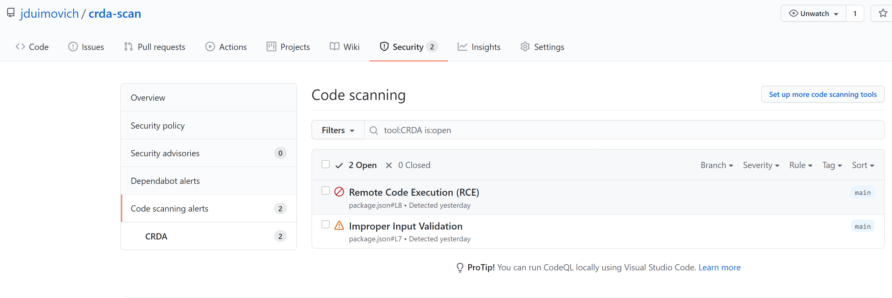

CRDA to Sarif converter demo

This demonstrates the use of the CRDA CLI  to scan the package.json file for vulnerabilities.
The file includes two known issues for the demo.

You can find the 
[CRDA CLI here !](https://github.com/fabric8-analytics/cli-tools/releases/tag/v0.0.1) 
 





See the sample workflow here
```
https://github.com/jduimovich/crda-scan/blob/main/.github/workflows/ci.yml
```

To use this you will need to set a secret SNYK_TOKEN. You can do this in the UI or via the gh cmd line.

```
gh secret set SNYK_TOKEN -b <your secret token> 
```

