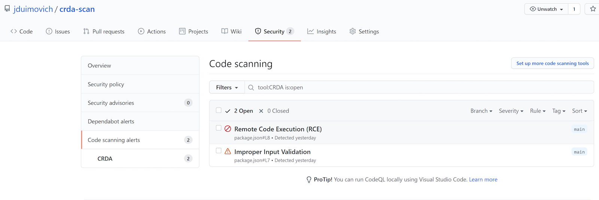

CRDA to Sarif converter demo

This demonstrates the use of the CRDA CLI  to scan the package.json file for vulnerabilities and upload to the code-ql security service.
The CRDA file outputs a json payload and this action converts it to SARIF so it can be used with code-ql. 
 
The file includes two known issues for the demo.

You can find the [CRDA CLI here !](https://github.com/fabric8-analytics/cli-tools/releases/tag/v0.0.1) 

To use it, use `jduimovich/crda-sarif-poc@main` in a workflow, as per this yaml (note only checks package.json) 
 
```
- name: Run CRDA and Convert to Sarif
        uses: jduimovich/crda-sarif-poc@main
        with:
          input-file-name: package.json
          snyk-token: ${{ secrets.SNYK_TOKEN }}
          output-file-name: output.sarif
```         

The result can be found in the security tab. 
          


See the file workflow example here.
```
https://github.com/jduimovich/crda-scan/blob/main/.github/workflows/ci.yml
```


To test this, you can fork this repo, enable the workflow and set a secret SNYK_TOKEN. You can do this in the UI or via the gh cmd line.
To get a snyk token, goto [snyk.io!](https://snyk.io/). 

```
gh secret set SNYK_TOKEN -b <your secret token> 
```
